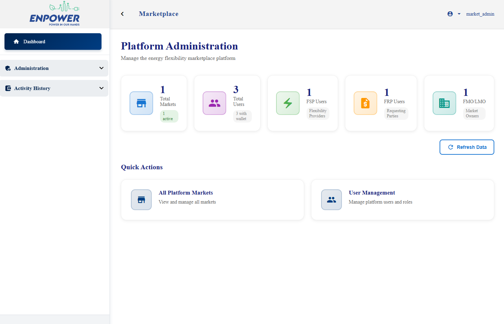
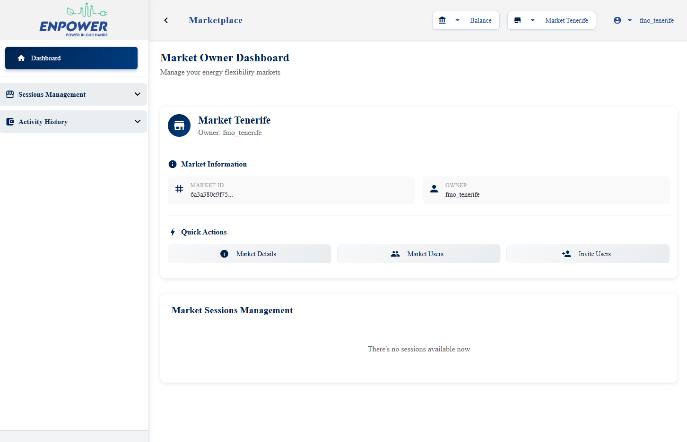
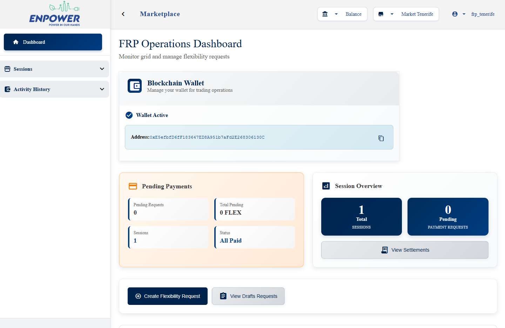
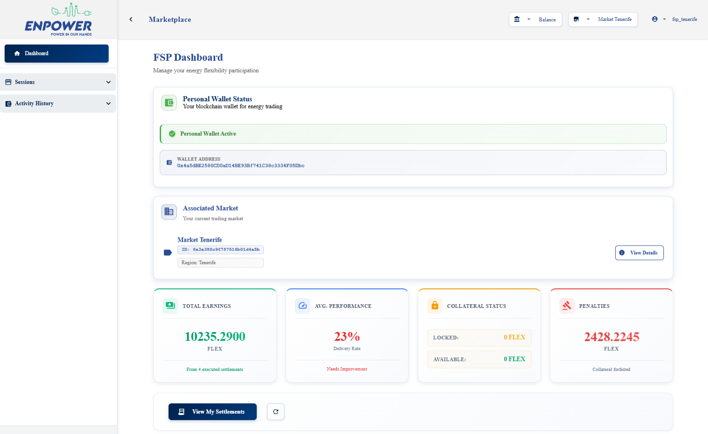
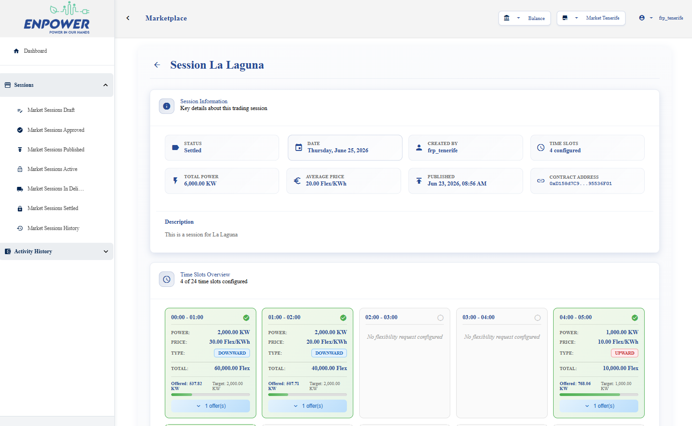
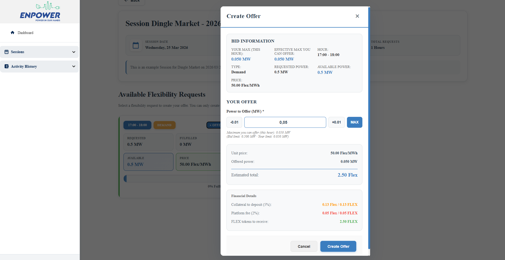
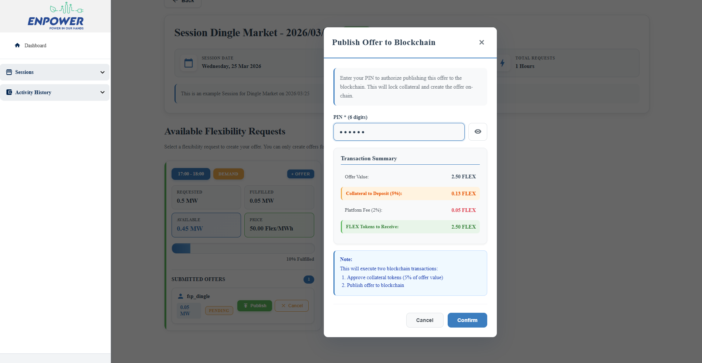
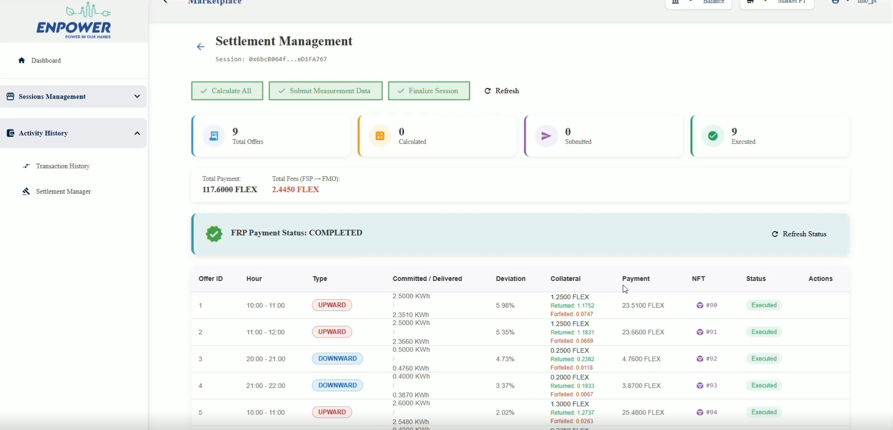
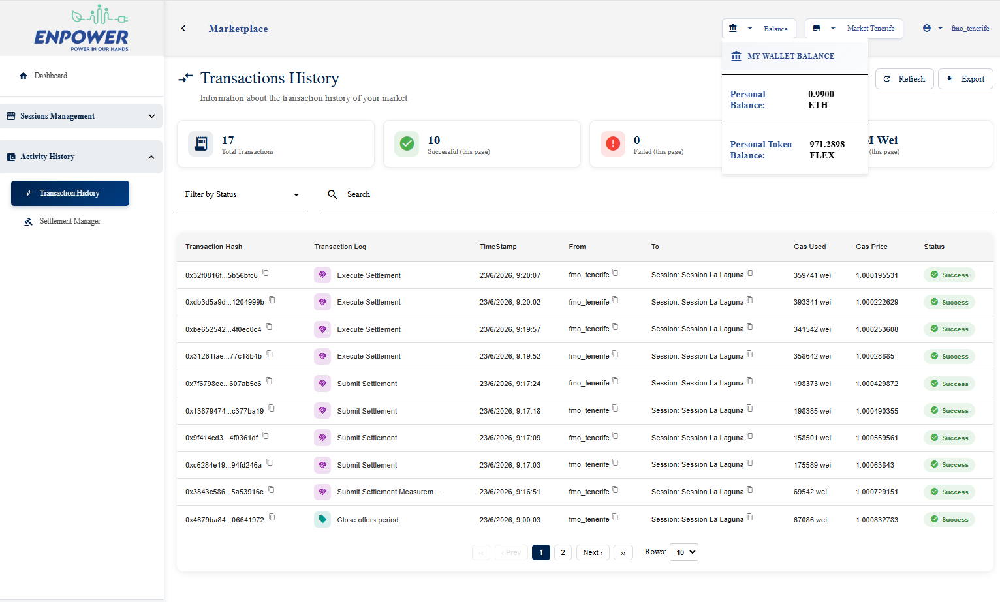
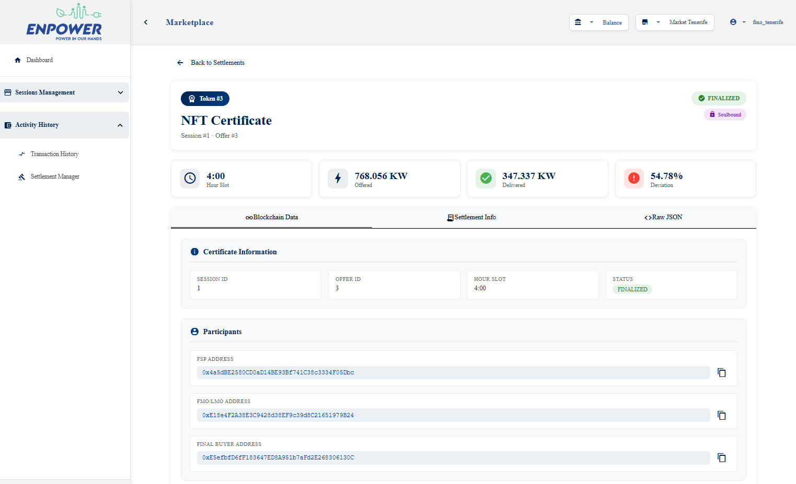

##### Table of Contents
[1. Overview](#1-overview)<br>
[2. Technology Stack](#2-technology-stack)<br>
[3. User Interface](#3-user-interface)<br>
&nbsp;&nbsp;&nbsp;[3.1 Landing Page and Authentication](#31-landing-page-and-authentication)<br>
&nbsp;&nbsp;&nbsp;[3.2 MARKETPLACE_ADMIN Dashboard](#32-marketplace_admin-dashboard)<br>
&nbsp;&nbsp;&nbsp;[3.3 FMO/LMO Dashboard](#33-fmolmo-dashboard)<br>
&nbsp;&nbsp;&nbsp;[3.4 FRP Dashboard](#34-frp-dashboard)<br>
&nbsp;&nbsp;&nbsp;[3.5 FSP Dashboard](#35-fsp-dashboard)<br>
&nbsp;&nbsp;&nbsp;[3.6 MarketSession Detail and Lifecycle Controls](#36-marketsession-detail-and-lifecycle-controls)<br>
&nbsp;&nbsp;&nbsp;[3.7 Offer Submission Wizard](#37-offer-submission-wizard)<br>
&nbsp;&nbsp;&nbsp;[3.8 Settlement Views](#38-settlement-views)<br>
&nbsp;&nbsp;&nbsp;[3.9 Wallet and Transaction History](#39-wallet-and-transaction-history)<br>
&nbsp;&nbsp;&nbsp;[3.10 FlexibilityNFT Certificate Detail](#310-flexibilitynft-certificate-detail)<br>
[4. Configuration](#4-configuration)<br>
[5. Development Setup](#5-development-setup)<br>
[6. Related Components](#6-related-components)<br>

---

# 1. Overview

<p align="justify">
The marketplace-fe sub-project is the Angular 19 frontend of the ENPOWER Marketplace Toolkit. It provides a role-aware browser interface through which MARKETPLACE_ADMINs, FMO/LMOs, FRPs, and FSPs interact with the full flexibility trading lifecycle — from market creation and participant onboarding, through MarketSession publication and offer submission, to on-chain settlement and FlexibilityNFT certificate retrieval. The application is built as a standalone-component Angular application (no NgModules).
</p>

<p align="justify">
Authentication is handled via Keycloak using the PKCE authorisation code flow. A custom AuthInterceptor attaches the Bearer token to every outgoing HTTP request, proactively refreshes the token when it is within 70 seconds of expiry, and forces logout on unrecoverable 401 responses. The active market context is read from a custom 'current_market' JWT claim injected by the backend into Keycloak, enabling the application to scope all data requests to the correct energy community market without requiring the user to pass a market identifier on every action. Multi-market users can switch their active market at any time via a market selection modal, which triggers a token refresh cycle to propagate the new context.
</p>

<p align="justify">
Blockchain interactions follow a server-side signing model: the frontend does not manage private keys or connect to an external wallet extension such as MetaMask. Instead, operations that require an on-chain transaction (publishing a MarketSession, submitting an offer, executing settlement steps) prompt the user for their 6-digit PIN via a modal dialog. The PIN is sent to the backend together with the transaction request; the backend decrypts the user's custodial wallet in memory, signs and broadcasts the transaction, and returns the result. The frontend then reflects the updated state.
</p>

<br>

---

# 2. Technology Stack

| Component | Technology | Version |
|---|---|---|
| Framework | Angular | ^19.0.0 |
| Language | TypeScript | ~5.6.2 |
| Node.js (build) | Node.js | 20 (alpine) |
| UI component library | Angular Material | ^19.2.19 |

<br>

---

# 3. User Interface

<p align="justify">
The application renders a role-specific dashboard immediately after login. The HomeComponent reads the roles from the Keycloak JWT and dispatches to one of four panel components: SuperadminPanel (MARKETPLACE_ADMIN), MarketOwnerPanel (FMO/LMO), DSOPanel (FRP), or ProsumerPanel (FSP). All views use Angular Material components for layout consistency.
</p>

## 3.1 Landing Page and Authentication

<p align="justify">
The public landing page presents the ENPOWER Marketplace platform with a login button that initiates the Keycloak PKCE flow. New participants invited by an FMO/LMO land on the public invitation acceptance page (<code>/accept-invitation/:token</code>), where they can review the invitation details and register a new account. Once authenticated, after login, users are redirected to their role-specific dashboard at <code>/home</code>.
</p>

## 3.2 MARKETPLACE_ADMIN Dashboard

<p align="justify">
The MARKETPLACE_ADMIN sees a platform-level overview panel with aggregate statistics: total markets, active markets, pending markets (awaiting FMO/LMO acceptance), total users, and per-role user counts (FMO/LMO, FRP, FSP). From this panel the admin can navigate to the market management section (<code>/markets-management</code>), which lists all markets regardless of state and provides create, edit, and deactivation actions. A dedicated market creation form (<code>/markets-management/create</code>) collects market metadata and provisions the FMO/LMO owner account, sending invitations by email. The admin can also invite users to markets and manage user status (deactivate/reactivate).
</p>



*Figure 1 — MARKETPLACE_ADMIN dashboard showing platform statistics cards (total markets, active markets, total users, users per role) and quick-access navigation to market management.*

## 3.3 FMO/LMO Dashboard

<p align="justify">
The FMO/LMO (market owner) panel displays the markets owned by the authenticated user, their current state, and a list of associated MarketSessions with their on-chain status. The panel exposes the full market management workflow: accepting or rejecting a pending market invitation, creating a market wallet (PIN-encrypted), activating the market on-chain (which triggers on-chain registration in the ParticipantRegistry, initial FlexibilityToken minting, and Market contract deployment via MarketFactory — all signed with the owner's PIN), and managing market participants via the invite user modal. The owner can navigate to the session management section to publish and advance the lifecycle of MarketSessions.
</p>


*Figure 2 - FMO/LMO dashboard showing owned markets with their status, active sessions list, and action buttons for market activation and participant management.*

## 3.4 FRP Dashboard

<p align="justify">
The FRP (Flexibility Requesting Party) panel presents the active MarketSessions of the assigned market. The FRP is responsible for creating and configuring sessions: the session creation collects the delivery date and per-hour flexibility requests (quantity in MW and price per unit for each time slot). Sessions in DRAFT status can be edited and then approved for FMO/LMO publication. On login, if the FRP has outstanding payment requests from the FMO/LMO, a modal dialog is displayed automatically listing the sessions for which FlexibilityToken deposits are required before settlement can proceed, along with the exact amounts. The wallet info card shows the FRP's current FlexibilityToken balance and ETH balance. A Treasury balance card shows the current state of funds held in escrow.
</p>


*Figure 3 - FRP dashboard showing active sessions list, wallet balance card, Treasury balance, and the pending payment request modal.*

## 3.5 FSP Dashboard

<p align="justify">
The FSP (Flexibility Service Provider) panel serves prosumers who submit flexibility offers. On first login if the FSP does not yet have a wallet, a wallet creation flow is presented. The panel shows the markets the FSP belongs to and the sessions currently open for offers. The FSP can navigate directly to the offer submission wizard for any open session.
</p>


*Figure 4 - FSP dashboard showing subscribed market, list of sessions open for offers, wallet balance card, and navigation to the offer submission wizard.*

## 3.6 MarketSession Detail and Lifecycle Controls

<p align="justify">
The session detail view provides a complete picture of a single MarketSession: metadata (delivery date, status, blockchain contract address), the per-slot flexibility requests table showing requested quantity and price for each hour, and the list of offers submitted for each slot. For FMO/LMO users, action buttons are rendered according to the current session state (publish (with PIN dialog), open offers (with PIN), close offers (with PIN), and return tokens (for cancelled sessions)). For FRP users, edit, approve or revert-to-draft (if already approved) actions are available on DRAFT sessions. The session can also be identified by its blockchain contract address.
</p>


*Figure 5 - MarketSession detail view showing session metadata, on-chain status chip, per-hour bid table, offers by slot, and the lifecycle action buttons visible to an FMO/LMO user.*

## 3.7 Offer Submission Wizard

<p align="justify">
The offer submission wizard is the primary interaction surface for FSPs. It loads the selected session's FRP flexibility requests alongside any offers the FSP has already created for that session, presenting them side-by-side grouped by hour. For each hour slot the FSP can open a create-offer modal to specify the energy quantity they can provide. Draft offers are saved off-chain and listed in the view. When the FSP is satisfied with a draft offer, they click publish and a PIN modal prompts for the 6-digit wallet PIN, which is sent with the publish request to the backend; the backend locks FlexibilityToken collateral (5%) plus the platform fee (2%) on-chain and registers the offer in the MarketSession contract. Published offers are marked accordingly in the view.
</p>


*Figure 6 - Offer submission wizard showing the session's hourly flexibility requests on the background on the left, the FSP's draft create-offer modal on front.*


*Figure 7 - Offer submission wizard showing the draft offer created on the background on the left and the FSP's PIN offer-publication modal on front.*


## 3.8 Settlement Views

<p align="justify">
The Settlement Manager lists all sessions in states that are eligible for settlement (status SETTLEMENT_PENDING) and is accessible to FMO/LMO, FRP, and FSP users with role-appropriate actions. Selecting a session navigates to the settlement page, which displays all settlement records for that session, showing for each offer the committed quantity, metered delivery, delivery ratio, payment amount, penalty (if any), and platform fee. FMO/LMO users see action buttons to request FRP payment, submit measurement data, and execute the two-step on-chain settlement for each offer. Each on-chain action requires PIN entry. FSP users can view only their own settlements, where each record links to the associated FlexibilityNFT certificate once the offer has been settled.
</p>


*Figure 8 - Settlement page for a completed session from the FMO_LMO perspective showing the settlement records table with offer details, delivery ratio, penalty, payment, NFT, status and action columns.*

## 3.9 Wallet and Transaction History

<p align="justify">
The Balance button shows the authenticated user's custodial wallet ETH balance, and FlexibilityToken (FLEX) balance, read directly from the blockchain via Ethers.js. The transaction history page lists all blockchain transactions associated with the user's wallet, with pagination and filtering by status or other parameters. FMO/LMO users additionally see a market-scoped transaction history covering all sessions of their market; MARKETPLACE_ADMINs can access the platform-wide transaction log.
</p>


*Figure 9 - Transaction history page, showing the Balance on top-right (ETH balance and FLEX token balance), and the paginated transaction history table with status filter.*

## 3.10 FlexibilityNFT Certificate Detail

<p align="justify">
Settled offers generate a soulbound FlexibilityNFT whose certificate can be viewed on the settlement section. Selecting a specific closed session, all NFTs will be listed alongside each completed offer. The detail view retrieves the NFT metadata from the blockchain via the NftService and presents the full provenance record: the session it was issued for, the committed and delivered quantities, the settlement outcome, the FSP and FMO/LMO wallet addresses involved, the on-chain token ID, and the transaction hashes of the mint and settlement operations. Since the NFT is soulbound upon settlement, the certificate serves as an immutable, verifiable proof of flexibility service delivery.
</p>


*Figure 10 - FlexibilityNFT certificate detail showing token ID, session reference, delivery ratio, settlement amounts, participant addresses, and blockchain provenance links.*

<br>

---

# 4. Configuration

<p align="justify">
Frontend configuration is managed via Angular environment files. Two files are provided: <code>src/environments/environment.ts</code> (development) and <code>src/environments/environment.prod.ts</code> (production build). The production build selects the production environment automatically via the Angular CLI file replacement mechanism.
</p>

| Variable | Description | Example |
|---|---|---|
| `production` | Enables production mode (disables debug logging) | `false` / `true` |
| `keycloakUrl` | Base URL of the Keycloak instance | `http://SERVER_IP:8088` |
| `keycloakRealm` | Keycloak realm name | `enpower-marketplace` |
| `keycloakClientId` | Public Keycloak client ID for the frontend | `frontend` |
| `apiUrl` / `apiGatewayUrl` | Backend REST API base URL. When using Docker Compose, nginx proxies `/api` to the backend — use `/api`. For local development without Docker, use the direct backend URL. | `/api` (Docker Compose) / `http://SERVER_IP:3000` (local dev) |
| `rpcProviderUrl` | Ethereum JSON-RPC endpoint for direct blockchain reads (must be accessible from the user's browser). When using Docker Compose, nginx proxies `/blockchain/` to the Hardhat node — use `/blockchain/`. For local development, use the direct node URL. | `/blockchain/` (Docker Compose) / `http://SERVER_IP:8545` (local dev) |
| `contracts.FLEXIBILITY_TOKEN` | Deployed FlexibilityToken contract address | `0x5FbDB2...` |
| `contracts.PARTICIPANT_REGISTRY` | Deployed ParticipantRegistry contract address | `0x9fE467...` |
| `contracts.TREASURY` | Deployed Treasury contract address | `0xCf7Ed3...` |
| `contracts.FLEXIBILITY_NFT` | Deployed FlexibilityNFT contract address | `0xDc64a1...` |
| `contracts.MARKET_FACTORY` | Deployed MarketFactory contract address | `0x5FC8d3...` |

<p align="justify">
Environment values are baked into the bundle at build time. The Docker image uses the production configuration (<code>ng build --configuration production</code>), so to change values edit <code>src/environments/environment.prod.ts</code> and rebuild the image with <code>docker compose build frontend</code> before restarting.
</p>

<br>

---

# 5. Development Setup

<p align="justify">
The application is deployed as part of the Docker Compose stack. Run the following from the repository root:
</p>

```bash
# Start the full stack
docker compose up -d

# Or start only the frontend and its dependencies
docker compose up -d hardhat mongodb backend frontend

# Available at: http://SERVER_IP:4200
```

<p align="justify">
The Dockerfile uses a two-stage build: the <strong>builder</strong> stage installs dependencies and produces a production Angular bundle with <code>ng build --configuration production</code>; the <strong>runtime</strong> stage copies the compiled static files into an NGINX 1.27 alpine image. The container exposes port <strong>80</strong> (mapped to <strong>4200</strong> in Docker Compose). If changes are made to the source code or environment files, rebuild before restarting:
</p>

```bash
docker compose build frontend
docker compose up -d frontend
```

<br>

---

# 6. Related Components

| Component | Path | Description |
|---|---|---|
| Marketplace Backend | [`../marketplace-be/`](../marketplace-be/) | REST API consumed by all services in this frontend |
| Smart Contracts | [`../flexibility-market-smartcontracts/`](../flexibility-market-smartcontracts/) | Deployed contract addresses must match those in `environment.ts`; ABIs are referenced locally in the core blockchain service |
| Ingestion Dashboard | [`../injection-dashboard/`](../injection-dashboard/) | Companion Angular frontend for monitoring the Energy Data Space ingestion pipeline |
